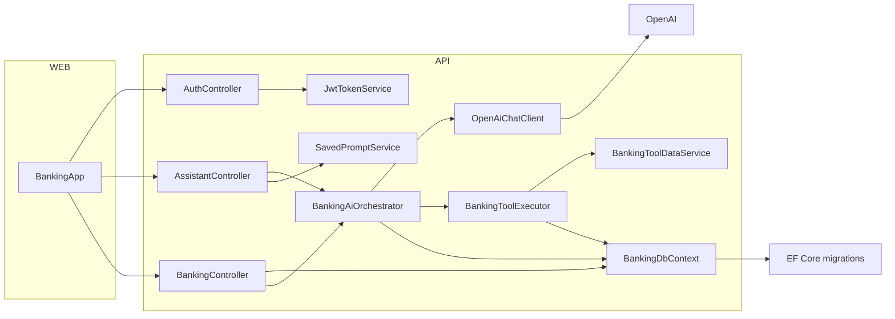

# BankingAIBot — Project Overview

This repository contains two main projects:

- `BankingAIBot.API` — ASP.NET Core Web API (backend)
- `BankingAIBot.Web` — Next.js React frontend (client)

**High-level summary**

- Backend: an ASP.NET Core (targeting .NET 9) API exposing controllers under `api/*`:
  - `AssistantController` — chat assistant endpoints (chat, sessions, prompts). Requires authentication.
  - `BankingController` — banking data endpoints (accounts, transactions, overview). Requires authentication.
  - `AuthController` — login/register and JWT token issuance.

- Backend services (key): `BankingAiOrchestrator` (orchestrates chat flow, tool calls, and persistence), `OpenAiChatClient` (wraps OpenAI calls), `BankingToolExecutor` / `BankingToolDataService`, `SavedPromptService`, `JwtTokenService`, and `BankingInsightsService`.

- Data: `BankingDbContext` (EF Core) with migrations and seeding (`DbSeeder`).

- Frontend: Next.js app in `BankingAIBot.Web`:
  - `src/components/BankingApp.tsx` — main UI component driving auth, dashboard, assistant UI and interactions.
  - `src/lib/api.ts` — thin client wrapper for `fetch` requests to the API (login/register, assistant, banking endpoints).

Mermaid architecture diagram



Quick run notes

- Backend (API):

  - From `BankingAIBot.API` directory run:

    ```powershell
    dotnet restore
    dotnet build
    dotnet run --project BankingAIBot.API.csproj
    ```

  - The API uses EF Core migrations and will run `context.Database.Migrate()` on startup; ensure the connection string (`ConnectionStrings:DefaultConnection`) is set in `appsettings.json` or `appsettings.Development.json`.

- Frontend (Web):

  - From `BankingAIBot.Web` directory:

    ```bash
    npm install
    npm run dev
    ```

  - The frontend expects `NEXT_PUBLIC_API_BASE_URL` or defaults to `https://localhost:7161` (see `src/lib/api.ts`).

References (key files)

- API entry: [BankingAIBot.API/Program.cs](BankingAIBot.API/Program.cs#L1)
- Assistant endpoints: [BankingAIBot.API/Controllers/AssistantController.cs](BankingAIBot.API/Controllers/AssistantController.cs#L1)
- Banking endpoints: [BankingAIBot.API/Controllers/BankingController.cs](BankingAIBot.API/Controllers/BankingController.cs#L1)
- Auth endpoints: [BankingAIBot.API/Controllers/AuthController.cs](BankingAIBot.API/Controllers/AuthController.cs#L1)
- Orchestrator: [BankingAIBot.API/Services/BankingAiOrchestrator.cs](BankingAIBot.API/Services/BankingAiOrchestrator.cs#L1)
- OpenAI client: [BankingAIBot.API/Services/OpenAiChatClient.cs](BankingAIBot.API/Services/OpenAiChatClient.cs#L1)
- Frontend main UI: [BankingAIBot.Web/src/components/BankingApp.tsx](BankingAIBot.Web/src/components/BankingApp.tsx#L1)
- Frontend API wrapper: [BankingAIBot.Web/src/lib/api.ts](BankingAIBot.Web/src/lib/api.ts#L1)

If you'd like, I can:

- Add a diagram PNG export or preview of the Mermaid diagram.
- Generate a more detailed sequence diagram for the assistant chat flow.
- Add environment variable examples for `.env` files.

---
Generated automatically from the workspace on April 7, 2026.
